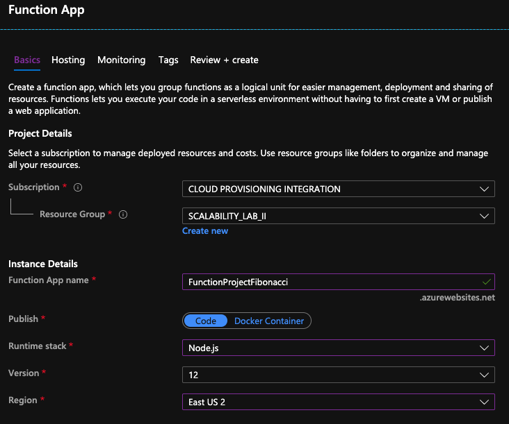
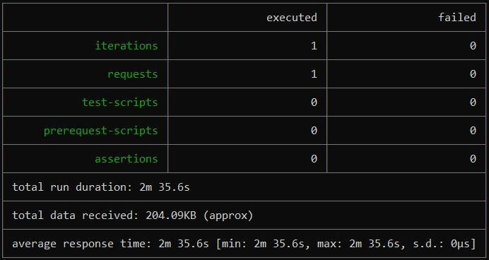
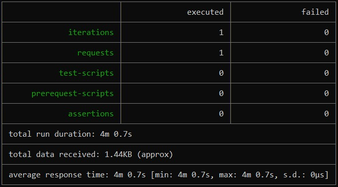
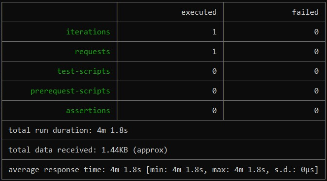
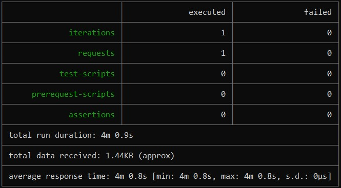
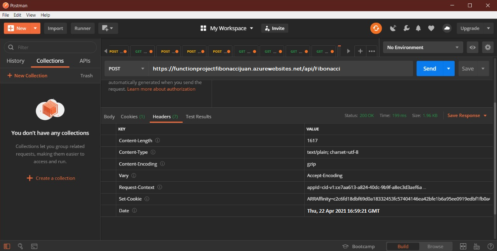
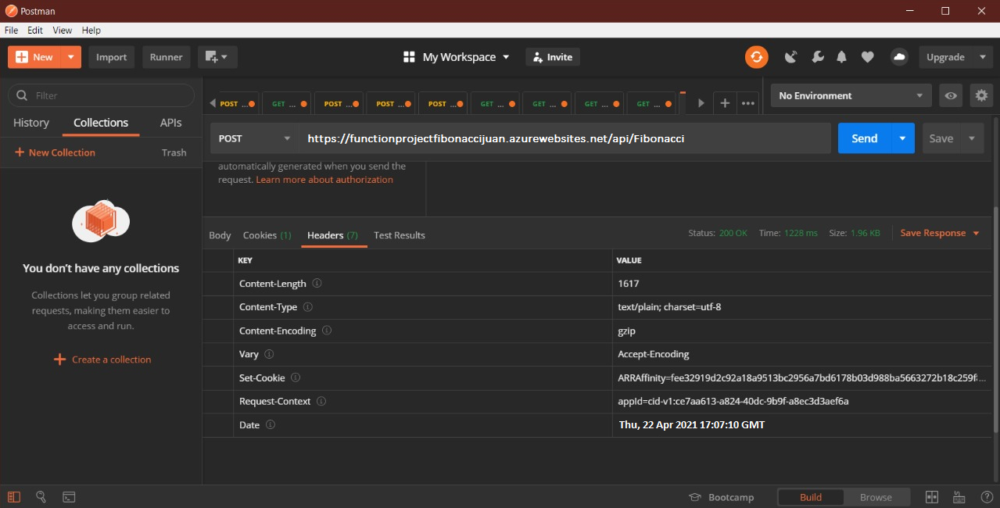
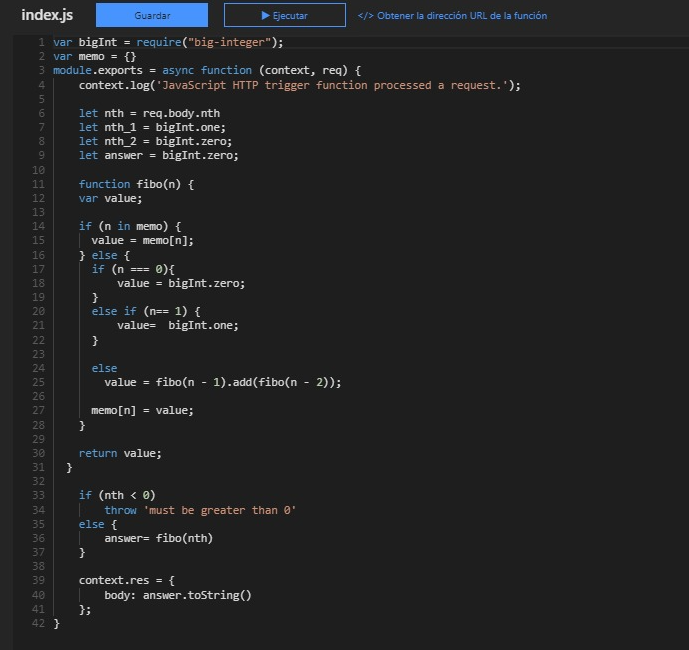

### Escuela Colombiana de Ingeniería
### Arquitecturas de Software - ARSW

## Escalamiento en Azure con Maquinas Virtuales, Sacale Sets y Service Plans

### Dependencias
* Cree una cuenta gratuita dentro de Azure. Para hacerlo puede guiarse de esta [documentación](https://azure.microsoft.com/en-us/free/search/?&ef_id=Cj0KCQiA2ITuBRDkARIsAMK9Q7MuvuTqIfK15LWfaM7bLL_QsBbC5XhJJezUbcfx-qAnfPjH568chTMaAkAsEALw_wcB:G:s&OCID=AID2000068_SEM_alOkB9ZE&MarinID=alOkB9ZE_368060503322_%2Bazure_b_c__79187603991_kwd-23159435208&lnkd=Google_Azure_Brand&dclid=CjgKEAiA2ITuBRDchty8lqPlzS4SJAC3x4k1mAxU7XNhWdOSESfffUnMNjLWcAIuikQnj3C4U8xRG_D_BwE). Al hacerlo usted contará con $200 USD para gastar durante 1 mes.

### Parte 0 - Entendiendo el escenario de calidad

Adjunto a este laboratorio usted podrá encontrar una aplicación totalmente desarrollada que tiene como objetivo calcular el enésimo valor de la secuencia de Fibonnaci.

**Escalabilidad**
Cuando un conjunto de usuarios consulta un enésimo número (superior a 1000000) de la secuencia de Fibonacci de forma concurrente y el sistema se encuentra bajo condiciones normales de operación, todas las peticiones deben ser respondidas y el consumo de CPU del sistema no puede superar el 70%.

### Escalabilidad Serverless (Functions)

1. Cree una Function App tal cual como se muestra en las  imagenes.

2. Instale la extensión de **Azure Functions** para Visual Studio Code.

3. Despliegue la Function de Fibonacci a Azure usando Visual Studio Code. La primera vez que lo haga se le va a pedir autenticarse, siga las instrucciones.

4. Dirijase al portal de Azure y pruebe la function.

5. Modifique la coleción de POSTMAN con NEWMAN de tal forma que pueda enviar 10 peticiones concurrentes. Verifique los resultados y presente un informe.

6. Cree una nueva Function que resuleva el problema de Fibonacci pero esta vez utilice un enfoque recursivo con memoization. Pruebe la función varias veces, después no haga nada por al menos 5 minutos. Pruebe la función de nuevo con los valores anteriores. ¿Cuál es el comportamiento?.

Comportamiento Inicial

Comportamiento 5 minutos después

Código memorizado

**Preguntas**

* ¿Qué es un Azure Function?

  * Azure Function: Mediante Functions, se desarrolla con más eficacia una plataforma de informática sin servidor basada en eventos que también puede solucionar problemas de orquestación complejos. Compile y depure a nivel local sin ninguna configuración adicional, implemente y opere a escala en la nube e integre servicios mediante desencadenadores y enlaces. 

* ¿Qué es serverless?

  * Serverless: Es un modelo de ejecución en el que el proveedor en la nube (AWS, Azure o Google Cloud) es responsable de ejecutar un fragmento de código mediante la asignación dinámica de los recursos. Y cobrando solo por la cantidad de recursos utilizados para ejecutar el código. El código, generalmente, se ejecuta dentro de contenedores sin estado que pueden ser activados por una variedad de eventos que incluyen solicitudes HTTP, eventos de base de datos, servicios de colas, alertas de monitoreo, carga de archivos, eventos programados (trabajos cron), etc.

* ¿Qué es el runtime y que implica seleccionarlo al momento de crear el Function App?

  * Runtime: Es el intervalo de tiempo en el que un programa de computadora se ejecuta en un sistema operativo. En Azure esta principalmente está relacionado con la versión de .NET en la que se basa el tiempo de ejecución.

* ¿Por qué es necesario crear un Storage Account de la mano de un Function App?

  * Esto se debe a que Functions se basa en Azure Storage para operaciones como la administración de desencadenantes y el registro de ejecuciones de funciones. Algunas cuentas de almacenamiento no admiten colas y tablas. Estas cuentas incluyen cuentas de almacenamiento sólo para blob, Azure Premium Storage y cuentas de almacenamiento de uso general con replicación ZRS.

* ¿Cuáles son los tipos de planes para un Function App?, ¿En qué se diferencias?, mencione ventajas y desventajas de cada uno de ellos.

  Azure Functions tiene tres planes de servicio diferentes:
  * Plan de consumo: Cuando se usa el plan de consumo, las instancias del host de Azure Functions se agregan y quitan de forma dinámica según el número de eventos entrantes. Este plan sin servidor se escala automáticamente y solo se le cobra por los recursos de proceso cuando se ejecutan las funciones. En un plan de consumo, se agota el tiempo de espera de una ejecución.  
    
    **Ventajas:**
      * Pague solo cuando se ejecutan las funciones.
      * Escale horizontalmente de forma automática, incluso durante períodos de gran carga.
  * Plan Premium: Cuando se usa el plan Prémium, las instancias del host de Azure Functions se agregan y quitan según el número de eventos entrantes al igual que con el plan de consumo.  
    
    **Ventajas:**
      * Constancias permanentemente semiactivas para evitar cualquier inicio en frío
      * Conectividad de red virtual
      * Duración de la ejecución ilimitada (60 minutos garantizados)
      * Tamaños de la instancia Prémium (un núcleo, dos núcleos y cuatro instancias de núcleo)
      * Precios más previsibles
      * Asignación de aplicaciones de alta densidad para planes con varias aplicaciones de funciones

  * Plan Dedicado (App Service): Sus aplicaciones de funciones también pueden ejecutarse en las mismas máquinas virtuales dedicadas que otras aplicaciones de App Service (SKU básica, estándar, prémium y aislada).  
    
    **Ventajas:**
      * Tiene máquinas virtuales infrautilizadas que ya ejecutan otras instancias de App Service.
      * Quiere proporcionar una imagen personalizada en la que ejecutar sus funciones.

* ¿Por qué la memoization falla o no funciona de forma correcta?

  * La memorización no funcionó correctamente debido a que después de un lapso de tiempo de no hacer ninguna petición en este caso cinco minutos esta memorización ya hecha se borro teniendo asi que volver a calcular la respuesta para el valor ingresado.

* ¿Cómo funciona el sistema de facturación de las Function App?
  * Ejecuciones: Functions se factura según el número total de ejecuciones solicitadas cada mes para todas las funciones. Las ejecuciones se cuentan cada vez que se ejecuta una función en respuesta a un evento, desencadenado por un enlace. El primer millón de ejecuciones es gratis cada mes.
  * Consumo de recursos: Functions se factura según el consumo de recursos observado, medido en gigabytes por segundos (GB-s). El consumo de recursos observado se calcula multiplicando el tamaño medio de memoria en GB por el tiempo en milisegundos que dura la ejecución de la función. La memoria que una función utiliza se mide redondeando al alza a los 128 MB más cercanos hasta un tamaño de memoria máximo de 1.536 MB, y el tiempo de ejecución se redondea al alza a los 1 ms más cercanos. Para la ejecución de una única función, el tiempo de ejecución mínimo es de 100 ms y la memoria mínima es de 128 MB, respectivamente. Los precios de Functions incluyen una concesión gratuita al mes de 400.000 GB-segundos.

* Informe
